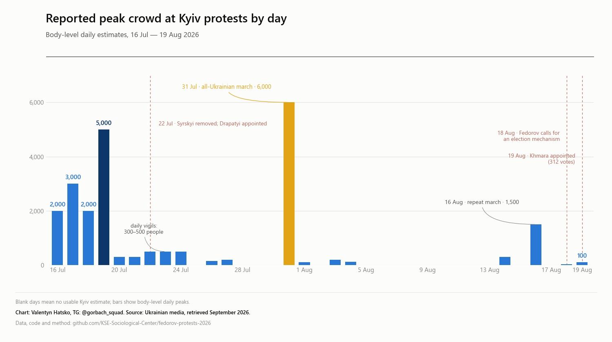

# Картонкові протести за Федорова: датасет публікацій ЗМІ, 16 липня — 29 серпня 2026

[](https://creativecommons.org/licenses/by/4.0/)

Датасет українських медіапублікацій про протести проти звільнення Михайла Федорова з посади міністра оборони України.

**919 публікацій · 129 доменів · 33 міста · 45 календарних днів.** Одиниця спостереження — публікація × місто. Для кожного запису збережено оригінальний заголовок, конкретний URL, дату, дослівну цитату з тіла сторінки, категорію розміру, статус, провенанс і зріз збору.

Збір перевірено до **1 вересня 2026 року**. Останні знайдені скоординовані багатоміські акції відбулися **19 серпня**, у день призначення Євгенія Хмари міністром оборони. Окрема локальна акція приблизно 15 людей у Дніпрі 29 серпня подовжує документований календарний період; відсутність пізніших знахідок не доводить, що незадокументованих акцій не було.

## Візуалізації




[Інтерактивна карта](https://kse-sociological-center.github.io/fedorov-protests-2026/) містить дослівні цитати, дати, статуси та посилання на джерела.

## Ключові результати

- Медіа задокументували акції у **33 локаціях**; у Херсоні протест відбувався онлайн.
- Найбільша окрема акція пройшла у Києві **31 липня, на 16-й день**. Поліція нарахувала близько **6 тисяч учасників**.
- 19 липня сума наявних міських оцінок становила приблизно **7 515 у десяти містах**. Це показник медійного покриття, а не оцінка всіх учасників в Україні.
- Дніпро має найбільше задокументованих днів акцій — **35**; Київ — **30**.
- Останні знайдені скоординовані багатоміські акції датуються **19 серпня**. Після них пошук виявив одну локальну акцію: близько 15 людей у Дніпрі 29 серпня.
- Числову пікову оцінку вдалося встановити для **24 із 33 локацій**; для восьми міст її немає, ще одна акція була онлайн.

## Період і охоплення

- Події: **16.07–29.08.2026**.
- Системний пошук: **15.07–01.09.2026**, київський час.
- Географія: Україна; закордонні акції згадуються лише в контексті й не нанесені на карту.
- 33 локації: 32 зі статусом `ended`, Херсон — `online`.
- 45 безперервних колонок дат у `by_day.csv`; у 35 днях є принаймні одна придатна міська оцінка.
- 101 новий рядок має `run = 1 Sep`; старі зрізи збережені.

Відсутність міста в датасеті означає «не знайдено підтвердженої публікації», а не «акції точно не було». «Білі плями» на карту не наносяться.

## Метод

Збір виконувався за [`prompt.md`](prompt.md):

1. Пошук у національних і регіональних медіа та редакціях Суспільного.
2. Пряме завантаження локальних видань, зокрема стрічок і sitemap мережі 0XX.ua, яку пошуковики індексують неповно.
3. Перевірка анонсованих міст і згадок у Telegram як наводок. Telegram і пошукові сніпети не використовуються як доказ кількості.
4. Завантаження конкретної сторінки та перевірка дослівної цитати в її тілі.
5. Один рядок на кожну пару публікація × місто. Повторна згадка в новому зрізі зберігається; дублікати всередині одного зрізу вилучаються.
6. Міський підсумок кодує пік за всю хвилю, а добовий ряд — лише число, прямо опубліковане для конкретного міста й дня.

Для зрізу 1 вересня discovery-прохід дав 200 URL кандидатів: 197 повернули HTTP 200, 164 мали придатне тіло. Прямий sweep 21 домену 0XX.ua не додав нового підтвердженого міста. Сім старих посилань на головні сторінки відновлено до конкретних матеріалів; один невідновлюваний допоміжний рядок `18000.com.ua` вилучено.

## Категорії

Пороги не змінювалися:

- `<100`
- `100–999`
- `1000–4999`
- `5000+`
- `unknown`
- `online`

Розподіл міст: `5000+` — 1; `1000–4999` — 1; `100–999` — 15; `<100` — 7; `unknown` — 8; `online` — 1. П'ять міських піків позначено `contested = yes`, коли джерела розходяться через межу категорії або мають істотно різні оцінки.

## Структура даних

```text
data/2026-07-16-fedorov/
    meta.json             двомовні назви, контрольна й фінальні дати, статус
    cities.csv            канон локацій і міських піків
    publications.csv      публікація × місто
    by_day.csv            міські оцінки за календарними днями
    prose.md              хронологія, методологія й покриття
    report.md             згенерований звіт
    map.png               статична карта
    chart_by_day.png      добовий графік
    map.html              інтерактивна карта
```

### `cities.csv`

| Поле | Значення |
|---|---|
| `city`, `oblast`, `lat`, `lon` | локація і координати |
| `category` | пікова категорія міста за всю хвилю |
| `quote_uk`, `quote_en` | дослівна цитата й англійський глос |
| `time` | час або дата, для яких чинна оцінка |
| `contested` | `yes` / `no` |
| `status` | `ended` / `online` |
| `first_day`, `last_day`, `days_active`, `peak_day` | часові характеристики задокументованих акцій |
| `source`, `link`, `note` | джерело піку й пояснення рішення |

### `publications.csv`

| Поле | Значення |
|---|---|
| `city`, `outlet`, `headline_uk`, `link` | публікація й місто |
| `published` | дата/час публікації; за потреби вказано дату події |
| `quote_uk` | дослівний фрагмент тіла сторінки |
| `category` | категорія для цієї згадки |
| `status` | історичний статус згадки: `announced`, `ongoing`, `online`, `refuted`, `took place` |
| `provenance`, `provenance_detail_uk` | походження оцінки |
| `run` | зріз збору |

У поточному файлі 911 рядків `took place`, 5 історичних `ongoing`, по одному `announced`, `online` і `refuted`. Історичний статус публікації не означає, що місто залишалося активним на 1 вересня.

### `by_day.csv`

Перший стовпець — місто, наступні 45 стовпців — безперервні дати `07-16`…`08-29`. Число записується лише за наявності міської оцінки в тілі джерела. Порожня клітинка — відсутня придатна оцінка, не нуль учасників.

## Відтворення

Потрібні Python 3, Pillow і Matplotlib.

```powershell
python build_report.py data\2026-07-16-fedorov
python build_map.py data\2026-07-16-fedorov
python build_chart.py data\2026-07-16-fedorov
python build_peak_chart.py data\2026-07-16-fedorov
python build_artifact.py data\2026-07-16-fedorov --site
python check_consistency.py data\2026-07-16-fedorov
```

Генератори не містять фіксованої тривалості або фінальної дати: вони читають їх із CSV і `meta.json`. `docs/` оновлюється опцією `--site`; деплой не виконується.

## Обмеження

- Розміри приблизні й залежать від медійного покриття.
- Більшість пізніх матеріалів підтверджують факт акції, але не дають кількості.
- Републікації не вважаються незалежним підтвердженням, якщо вони посилаються на те саме первинне джерело.
- `dateModified` і дата публікації не замінюють дату події в тексті.
- Пошук після 29 серпня був негативним, але не доводить відсутність незадокументованих акцій.

## Цитування

> Hatsko, V. (2026). *Protests over Mykhailo Fedorov leaving the Defence Ministry: a dataset of Ukrainian media publications, 16 July–29 August 2026.* Center for Sociological Research, KSE University. Collection checked 1 September 2026. CC BY 4.0.

*Розміри протестів приблизні. Збір перевірено до 1 вересня 2026 року; деякі локації можуть бути відсутні.*
