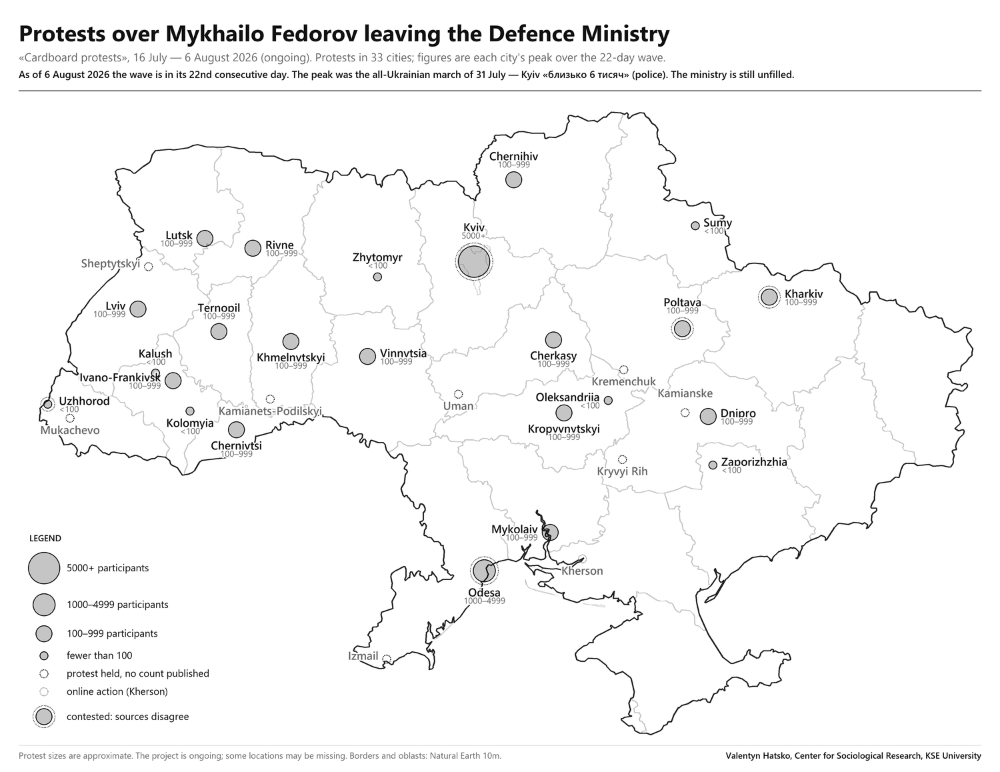
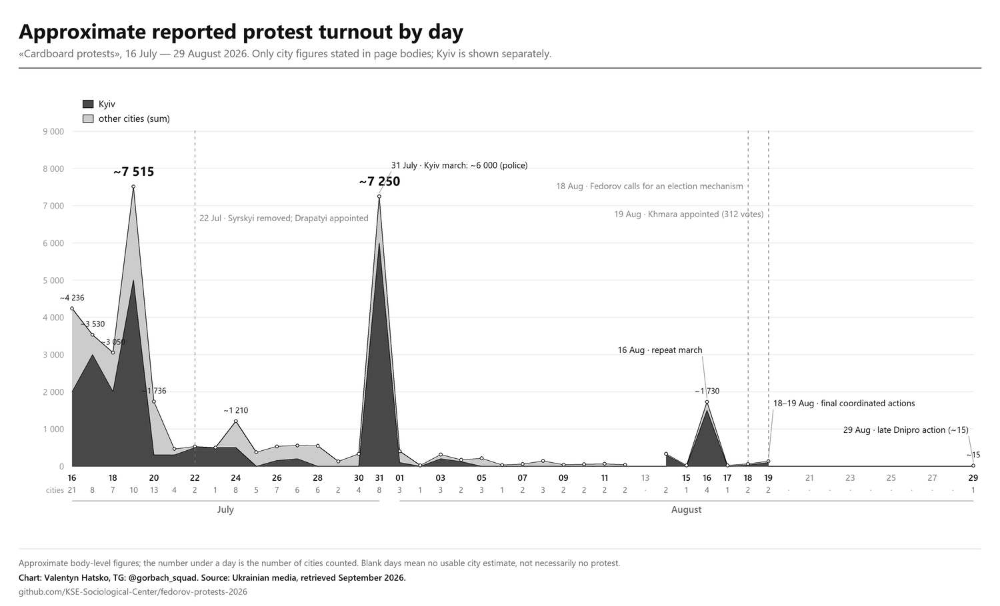

# fedorov-protests-2026

A dataset of the protests that followed Mykhailo Fedorov's departure from the post of Minister of Defence of Ukraine, compiled from media reports. Contains the collection prompt, the data, and scripts that generate the map and the report.

Event dates: 16 July – 6 August 2026 (ongoing, day 22). The protests are known as «cardboard protests» after the handwritten signs their participants carried.

Everything is in English **except verbatim quotes**, which stay in the original Ukrainian: the `quote_uk` column is defined as the outlet's exact words, and translating a quote turns evidence into paraphrase. English glosses live alongside in `quote_en`. Headlines are likewise kept as published.

## 1. Data source

**Population.** Publications by Ukrainian media (national, regional, local) covering protests connected to Fedorov leaving office. English-language agencies (Interfax-Ukraine, Kyiv Post, AFP, AP) are included to cross-check the Kyiv figure.

**Period.** 15 July – 6 August 2026. Latest run 6 August 2026; the wave is in its twenty-second consecutive day and ongoing.

**Unit of observation.** Publication × city. A publication covering several cities yields several rows.

**Size.** 819 publications, 127 domains, 33 locations, 22 days.

**Sampling.** Three independent procedures:

1. Parsing national round-ups and live blogs (Suspilne, TSN, NV, Ukrainska Pravda, LB, RBC, Detector Media, Censor.NET, Glavcom, 24 Kanal, ZAXID, ZN.UA, KP.UA), which enumerate cities themselves.
2. Direct retrieval from Suspilne's regional desks (22 sections) and local outlets, for every city found in step 1.
3. A gazetteer sweep: 499 Ukrainian city names from Wikidata queried through Google News, requiring the name in the headline. Validated on Kremenchuk, which the procedure finds independently. Coverage: cities ≥30k. Yield beyond procedures 1–2: Kolomyia (day 1), Uman (day 4) and, in the 6 August run, **Izmail, Kalush, Sheptytskyi, Oleksandriia and Kamianets-Podilskyi** (see §5).

**Discovery channel.** Google News RSS (`hl=uk&gl=UA`); the built-in web search is US-only and returns nothing for Ukrainian queries. RSS items link to `news.google.com` redirect tokens rather than publishers, so the 6 August run resolved each token to its publisher URL before fetching, then fetched every distinct URL once — 1,095 items resolved, 1,088 pages retrieved (99.4%).

**Text retrieval.** Raw page (`curl`), tags stripped, quote located by literal string match. Search-engine snippets and summarizer models were not used as a source of figures. See §3.6.

## 2. Variables

### `cities.csv` — unit: location (N = 33)

| Variable | Type | Domain / example |
|---|---|---|
| `city` | text | Kyiv, Kharkiv, … |
| `oblast` | text | Kyiv City, Kharkiv, … |
| `lat`, `lon` | float | coordinates, WGS84 |
| `category` | categorical | `5000+` · `1000–4999` · `100–999` · `<100` · `unknown` · `online` |
| `quote_uk` | text | verbatim, as published: «близько 300 людей, їхня кількість збільшується» |
| `quote_en` | text | English gloss: "about 300 people, and their number is growing" |
| `time` | time | the moment the figure is valid for |
| `source` | text | outlet plus attribution: Suspilne Kharkiv (police spokesperson Liudmyla Prokopenko) |
| `link` | URL | the specific publication |
| `contested` | binary | `yes` (5) · `no` (28) |
| `status` | categorical | `ended` (13) · `took place` (11) · `ongoing` (8) · `online` (1) |
| `first_day`, `last_day` | date | first and last day on which a protest there is documented |
| `days_active` | integer | count of distinct documented protest days (Kyiv 22 · Dnipro and Ivano-Frankivsk 21 · Uzhhorod 19) |
| `peak_day` | date | the day the `category` figure belongs to |
| `note` | text | justification for the assigned category; conflicting versions |

### `publications.csv` — unit: publication × city (N = 819)

| Variable | Type | Domain / example |
|---|---|---|
| `city` | text | key into the location table |
| `outlet` | text | Suspilne Kharkiv, MediaPort, … |
| `headline_uk` | text | headline as published, original language |
| `link` | URL | publication |
| `published` | text | publication time, with update time where given |
| `quote_uk` | text | verbatim quote about the crowd size |
| `category` | categorical | `unknown` (572) · `100–999` (126) · `<100` (89) · `1000–4999` (29) · `5000+` (3) |
| `status` | categorical | `took place` (811) · `ongoing` (5) · `online` (1) · `refuted` (1) · `announced` (1) |
| `provenance` | categorical | `not stated` (381) · `own correspondent` (257) · `relay` (164) · `police` (13) · `open-source photo` (4) |
| `provenance_detail_uk` | text | raw attribution as published: «речниця поліції Харківщини Людмила Прокопенко» |
| `run` | time | collection pass: `13:00` · `15:00` · `18 Jul` · `19 Jul` · `19 Jul PM` · `6 Aug` (669 rows, days 5–22) |

## 3. Value assignment

### 3.1 `category`

The figure must satisfy three conditions at once: it agrees across several independent sources, it is the latest in time, and it is the largest. The target quantity is the **daily maximum**, not the count at the snapshot time.

Each condition alone produces a systematic error:

| Condition alone | Error | Example |
|---|---|---|
| largest | headline inflation | TSN headline «тисячі людей», body text «сотні» |
| latest | post-peak snapshot | Kharkiv: peak ~300 at 10:12, police counted 200 at 12:10 |
| source agreement | reprint mistaken for confirmation | the national round-up copies the regional desk verbatim |

The `<100` / `100–999` boundary falls where the data clusters: the modal phrasing in Ukrainian media is «близько сотні» (about a hundred). Convention: «близько сотні» codes as `100–999`, applied uniformly to all locations.

The `1000–4999` / `5000+` boundary was added in the 6 August run, when the old top band had come to span an order of magnitude — Odesa's «близько тисячі» and Kyiv's «близько 6 тисяч» sat in the same category. 5000 is a round number that falls in a real gap in this dataset: no city was ever reported between 1400 and 5000, and above 5000 there is only Kyiv, on two days.

### 3.2 `time`

The moment the figure is valid for, **not** the page's `dateModified`. Priority of time sources:

1. A marker inside the text: «ОНОВЛЕНО. 13:30», «станом на 9:05».
2. Publication time, if the figure appears in the original version.
3. `dateModified`, as an upper bound only, flagged in `note`.

Rationale: the CMS updates the stamp without changing content. Four such cases occur in the source set; in one, Suspilne's Lutsk article moved from 14:04 to 15:57 while the body stayed byte-identical.

### 3.3 `contested`

`yes` when sources place the figure on opposite sides of a category boundary. Both versions are then kept in `note` with source and time, and the chosen category is justified there.

A discrepancy explained by crowd growth does **not** count as contested:

```
Dnipro         ~100 (09:34) → several hundred (10:53) → ~300 (12:23)
Cherkasy        ~30 (09:44) → ~100 (12:15)
Khmelnytskyi    ~50 (09:05) → ~100 (09:30)
Kharkiv        ~100 → ~300 within half an hour
```

Contested in this snapshot (5 of 33): **Kyiv** — the 31 July march has the widest published range in the dataset, from «близько тисячі» (Kyiv24, taken at 19:54 before the march filled) through «кілька тисяч» (Radio Svoboda's own correspondents) and the **police «близько 6 тисяч»** taken here, to the organisers' own «до 15 000» and Kyiv Post's «десятки тисяч»; **Kharkiv** («щонайменше 300» unattributed against «близько 200» from the police); **Poltava** (local newsrooms counted ~70 themselves against Suspilne's «близько сотні»); **Odesa** (the day-4 «близько тисячі» is single-source and sits at the 1000 boundary); and **Uzhhorod**, added in the 6 August run — Ukrinform's headline claims the crowd «зросла до двох сотень» while its own body gives no absolute number, only «майже вдвічі більше людей, аніж раніше» (see §3.6).

### 3.4 `provenance`

Codes the type of evidence, not the name of the outlet. Priority under mixed attribution: `police` > `own correspondent` > `relay` > `open-source photo` > `not stated`. The official estimate ranks first because it is the only figure produced outside editorial judgement; the dataset contains two (Kharkiv, Ivano-Frankivsk). The raw wording is preserved in `provenance_detail_uk`.

### 3.5 `status`, `unknown` and `online`

`unknown` and `online` are distinct states, not a count of zero.

- `unknown`: the protest is documented, no source gives a number (Chernihiv, Kryvyi Rih, Kremenchuk, and the day-4 additions Mukachevo, Kamianske, Uman).
- `online`: no street protest took place, for a documented reason, and the protest moved to another format. Kherson: «Через безпекову ситуацію жителі Херсона долучаються до акції онлайн».
- Sumy codes as `<100` with the phrasing «до двадцяти людей»: single pickets and cardboard signs left around the city instead of a rally. KP.UA's claim that the action was cancelled is refuted by an on-scene report with photos (Tsukr).

### 3.6 Systematic source distortions

**National round-ups lag their own regional desks.** The round-up copies the regional text verbatim and updates the figure late. Suspilne's round-up at 11:41: Mykolaiv «26» against the regional «45» (−42%), Dnipro «близько 100» against «близько 300» (−66%). The direction is not constant: in Kharkiv the round-up gave more than the regional desk. Rule: retrieve both, decide by time.

**Fabrication in snippets.** The phrases «кілька тисяч людей» (Kyiv), «близько тисячі» (Kharkiv), «близько 400 молодих людей» (Lviv) appear in no page body. False attribution recorded: an AFP quote credited to Reuters.

**Fabrication in summarizer models.** Passing a page through WebFetch returned "Organizers estimated" where the text reads «за попередньою оцінкою», with no source of the estimate given.

**Headline inflation.** Figures are taken from the body text only.

**Aggregate figures.** «Сотні людей» in 056.ua covers Dnipro, Kryvyi Rih and Kyiv together; it is not assigned to any single location.

**Errors in sources are recorded, not corrected.** Censor.NET's Mykolaiv section calls Fedorov the Minister of Digital Transformation, contradicting its own text.

**Technical sources of false zeroes.** `dumskaya.net` and `monitor.cn.ua` serve windows-1251; reading them as UTF-8 destroys the Cyrillic. Ukrainian inflects city names: searching «Кременчук» returns nothing where the text reads «Кременчуці», so search runs on the stem. Telegram serves timestamps in UTC (Kyiv = UTC+3). The 0XX.ua network is not indexed by search engines and is retrieved from its `/news` feed directly.

**A fixed city list yields confirmation, not discovery.** Uzhhorod, Zhytomyr, Kropyvnytskyi and Kryvyi Rih held protests despite being absent from the organisers' announcement; Kremenchuk appears in no national round-up parsed here. Procedures 2 and 3 in §1 do not depend on a predefined list.

## 4. Files

The data exists in one copy. Edit the CSVs only; everything else is generated.

```
prompt.md                       collection prompt, reusable with a different period
build_gazetteer.py              tiered city gazetteer → gazetteer.csv (self-tested)
gazetteer.csv                   generated: cities ≥20k, tiers A/B, declension-safe stems
geo.py                          borders and oblasts, Natural Earth 10m admin_1
build_map.py                    cities.csv        → map.png
build_report.py                 both CSVs + prose → report.md
build_artifact.py               cities.csv        → map.html
build_chart.py                  by_day.csv        → chart_by_day.png
check_consistency.py            verifies the artifacts against each other
data/2026-07-16-fedorov/
    meta.json                   title, date, snapshot time, author
    cities.csv                  canonical: locations
    publications.csv            canonical: publications
    by_day.csv                  canonical: approx turnout per city per day, 22 MM-DD columns
    prose.md                    hand-written part of the report, markers for generated tables
    report.md                   generated
    map.png                     generated
    map.html                    generated
    chart_by_day.png            generated
```

The build scripts live at the root and are dataset-agnostic. Each takes the dataset directory as an argument, defaulting to `data/2026-07-16-fedorov`. A new event is a new folder under `data/`, not a new script. Everything specific to one event (title, snapshot time, author) sits in that folder's `meta.json`.

`check_consistency.py` checks that the sets of cities and categories match across CSV, report and HTML; that the distribution sums to the row count; that no row predates the collection period (the July 2025 protests share the same keywords); and that no link points at a homepage instead of a publication. `build_map.py` additionally reports label collisions and text that overflows the canvas.

```bash
pip install pillow
python build_map.py        data/2026-07-16-fedorov
python build_report.py     data/2026-07-16-fedorov
python build_artifact.py   data/2026-07-16-fedorov
python check_consistency.py data/2026-07-16-fedorov
```

Borders: Natural Earth 10m admin_1, 24 oblasts plus Kyiv, Crimea and Sevastopol, dissolved into a national outline with `shapely`. Natural Earth assigns Crimea and Sevastopol to Russia; this dataset renders them as Ukraine.



Approximate aggregate turnout by day (Kyiv shown separately, as it dominates each day; later days undercount non-Kyiv cities, so those totals are lower bounds):



## 5. Limitations

**The snapshot is open-ended.** The protest is in its twenty-second consecutive day (16 July – 6 August) and still running at the 6 August snapshot. Each location carries its peak over the 22-day wave; where a crowd was still growing when last recorded, the figure is a lower bound. Fedorov has not been reappointed and was removed from the National Security and Defence Council on 31 July; Syrskyi, whose dismissal the protesters demanded from day 2, was removed in late July and Drapatyi appointed. Further days are likely.

**The peak is on day 16, not day 1.** This inverts the usual decay and is the single most important revision in the 6 August run. The wave fell steadily from 20 July, bottomed out around 26–30 July — DW headlined «учасників стає дедалі менше» — then produced its largest action of all on **31 July**, the all-Ukrainian «Єдина протестна хода», before collapsing again in August. A four-day snapshot cannot show this shape.

**The summed daily series peaks twice, and only one crest is about turnout.** In `chart_by_day.csv` the sum is slightly higher on 19 July (~7,500) than on 31 July (~7,250), but ten cities published a figure on 19 July against eight on 31 July. **The early crest is coverage, not crowds.** Both are labelled on the chart for that reason. The summed series should not be read as a national turnout estimate: it is the sum of whatever was counted that day, and what was counted thinned sharply as the wave aged.

**Kyiv.** Suspilne has no Kyiv desk. The day-1 peak (~2,000) rests on Interfax, LB, Kyiv Post and AFP; day 2 reached «близько 3 тисяч» (LB, own correspondent) and day 4 «понад 5000» (Interfax via LIGA). For 16 days no police or city-administration figure existed at all. That changed on **31 July**, the only day of the whole wave with an official estimate: «близько 6 тисяч осіб» (Ukrinform; also Fakty ICTV), which Bukvy attributes to the police via Radio Svoboda and Ukrinform. It is taken as the peak under §3.4 and marked contested, because the published range that evening spans an order of magnitude — «близько тисячі» (Kyiv24, 19:54), «кілька тисяч» (Radio Svoboda), «до 15 000» (the organisers' own count), «десятки тисяч» (Kyiv Post).

**Single-source locations.** Kolomyia, Mukachevo, Kamianske, Uman, and the 6 August additions Izmail, Sheptytskyi and Oleksandriia rest on one source each; a targeted search produced no second confirmation. Kamianets-Podilskyi has two mentions but both are relays, and no piece by the originating outlet (ZHAR.INFO) was retrievable.

**`days_active` is a floor, not a census.** It counts the distinct days on which a protest in that city is documented by at least one publication in this dataset. A low count means thin coverage as often as it means a short protest: Kremenchuk shows 7 days while its own local press reported «Кременчук стоїть уже 21-й день» on 5 August. Only Kyiv (22) is documented on every day of the wave.

**Incomplete coverage of small towns.** The gazetteer sweep covered cities ≥30k (111 names beyond the initial list). The <30k tier (364 names) was not run: Google News begins returning 503 after roughly 475 queries. A Telegram-monitoring map (ПошукAI, 17 July) had flagged four further cities — Irpin, Boryspil, Kalush, Drohobych. The 19 July run found no independent source for any of them. The 6 August run, re-running the sweep across eighteen more days of round-ups, **found one of the four: Kalush** — «понад 50 людей другий день поспіль» (Suspilne Ivano-Frankivsk, own correspondent), which also dates its first action to 19 July, inside the previous snapshot's own period. Irpin, Boryspil and Drohobych still have no verifiable article and stay off the map. Almost every gazetteer hit remains a false positive: the organiser's surname «Козятинський» matches the stem `Козятин`, the President's name «Володимир» matches the city, war-attack sidebars supply Pavlohrad, Nikopol and Kostiantynivka, a businessman's surname supplies Konotop, and a raspberry cheesecake supplies Malyn. The discovery procedure is in `prompt.md` §4; the tiered city list with declension-safe stems is `gazetteer.csv`.

**Out of scope, though documented.** Solidarity rallies abroad — Warsaw, Brussels, Sydney (24 Kanal, «від Брюсселя до Сіднея», 18 July) — are outside this population, which is Ukrainian cities covered by Ukrainian media, and would not fit the Ukraine-only map. So is the second-order literature on how the protests were covered: IMI on Chernihiv's local media, Zhytomyr.info on Zhytomyr's, Detector Media on Telegram channels that suppressed the cause, and Ukrainska Pravda's «Битва за Федорова» on the information space. Both are recorded here as boundaries rather than gaps.

**Links.** In the location table, all 33 links resolve to specific articles. Every one of the 669 links added in the 6 August run returned HTTP 200 at verification, and every quote in that block was confirmed as a verbatim substring of the retrieved page body. In the publication table, 8 rows (day-1 supporting sources) still point at outlet homepages.

**Sparse figures in the later days.** 566 of 819 publication rows carry no crowd figure. This is a property of the coverage, not of the collection: as the wave aged, outlets kept reporting that a protest had happened and stopped counting who came. 504 of the 669 rows added on 6 August carry `невідомо` for that reason.

**Categorical scale.** The lower three bands (`<100`, `100–999`, and the 1000 boundary) follow the reference map of the protests against law 12414; the fourth, splitting the top band at 5000, was added in the 6 August run and is this dataset's own. **Comparisons with the law-12414 map should therefore merge `1000–4999` and `5000+` back into a single `1000+`.** The boundary at 100 falls where the data clusters, so some locations are coded by the convention in §3.1 rather than by an exact count. Only Kyiv occupies the top band, and only on 19 and 31 July.

## Authorship

Data and map: Valentyn Hatsko, Center for Sociological Research, KSE University.
Borders: [Natural Earth](https://www.naturalearthdata.com/), public domain.
Quotes belong to the respective outlets; links point to the original publications.

*Protest sizes are approximate. The project is ongoing; some locations may be missing.*
